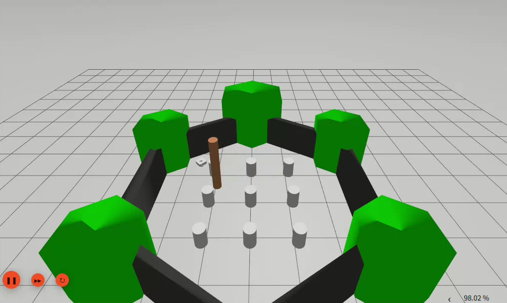

# ROS 2 Nav2 TurtleBot3 Waypoints



Multi-goal navigation for TurtleBot3 in Gazebo with Nav2 (ROS 2 Jazzy). Scripts send `NavigateToPose` goals in sequence. Two pedestrians walk back and forth across the path; the robot stops when the front laser sector is occupied and resumes after they pass (no detour).

Related: [mujoco-panda-grasp](https://github.com/yuboyaocreater/mujoco-panda-grasp) (tabletop arm grasping).

## Requirements

- Ubuntu 24.04
- ROS 2 Jazzy: `navigation2`, `nav2-bringup`, `turtlebot3-gazebo`, `ros-gz-sim`

```bash
source /opt/ros/jazzy/setup.bash
export TURTLEBOT3_MODEL=waffle
```

## Usage

Run from the repository root. Keep the simulation running in a separate terminal.

```bash
# terminal 1
source /opt/ros/jazzy/setup.bash
export TURTLEBOT3_MODEL=waffle
ros2 launch nav2_bringup tb3_simulation_launch.py use_composition:=False headless:=False

# terminal 2
source /opt/ros/jazzy/setup.bash
bash ./00_set_initial_pose.sh
bash ./01_activate_nav.sh
python3 ./04_pedestrians.py

# terminal 3（行人脚本保持运行）
source /opt/ros/jazzy/setup.bash
python3 ./02_multi_goals.py
```

Waypoints are `WAYPOINTS` in `02_multi_goals.py`. Front-wait uses `/scan` in a forward cone; it cancels the current goal while occupied, then resends the same pose.

Optional speed compare (empty world, no walkers needed):

```bash
bash ./03_set_max_vel.sh 0.10
python3 ./02_multi_goals.py
bash ./03_set_max_vel.sh 0.26
python3 ./02_multi_goals.py
```
